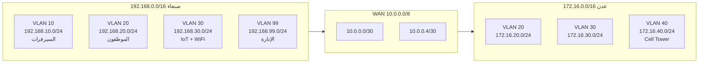

# 01 — خطة العنونة (IP Addressing Plan)

هذه الخطة هي مرجع المشروع كله. اطبعها بجانبك أثناء العمل.

---

## 1) الشبكات الرئيسية

### مدينة صنعاء — `192.168.0.0/16`

| VLAN | الاسم | الشبكة | Gateway | الاستخدام |
|---|---|---|---|---|
| 10 | `SERVERS` | 192.168.10.0/24 | 192.168.10.1 | السيرفرات (ثابتة) |
| 20 | `USERS` | 192.168.20.0/24 | 192.168.20.1 | أجهزة الموظفين السلكية (DHCP) |
| 30 | `IOT` | 192.168.30.0/24 | 192.168.30.1 | الشبكة اللاسلكية وأجهزة IoT (DHCP) |
| 99 | `MGMT` | 192.168.99.0/24 | 192.168.99.1 | إدارة السويتشات (Native VLAN) |

### مدينة عدن — `172.16.0.0/16`

| VLAN | الاسم | الشبكة | Gateway | الاستخدام |
|---|---|---|---|---|
| 10 | `SERVERS` | 172.16.10.0/24 | 172.16.10.1 | سيرفر محلي (اختياري) |
| 20 | `USERS` | 172.16.20.0/24 | 172.16.20.1 | أجهزة الموظفين (DHCP من الراوتر) |
| 30 | `IOT` | 172.16.30.0/24 | 172.16.30.1 | المستودع الذكي (DHCP من الراوتر) |
| 40 | `CELL` | 172.16.40.0/24 | 172.16.40.1 | شبكة برج الاتصالات |
| 99 | `MGMT` | 172.16.99.0/24 | 172.16.99.1 | إدارة السويتش |

### روابط الـ WAN بين المدن — `10.0.0.0/8`

| الرابط | الشبكة | الطرف الأول | الطرف الثاني |
|---|---|---|---|
| R1 ↔ ISP | 10.0.0.0/30 | R1 = 10.0.0.1 (DCE) | ISP = 10.0.0.2 |
| ISP ↔ R2 | 10.0.0.4/30 | ISP = 10.0.0.5 (DCE) | R2 = 10.0.0.6 |

> `/30` = قناع `255.255.255.252` ← عنوانان صالحان فقط، وهو المثالي لروابط النقطة للنقطة.

---

## 2) جدول عناوين الأجهزة الثابتة

### صنعاء

| الجهاز | المنفذ | عنوان IP | القناع | Gateway |
|---|---|---|---|---|
| **R1-SANAA** | Gi0/0.10 | 192.168.10.1 | 255.255.255.0 | — |
| | Gi0/0.20 | 192.168.20.1 | 255.255.255.0 | — |
| | Gi0/0.30 | 192.168.30.1 | 255.255.255.0 | — |
| | Gi0/0.99 | 192.168.99.1 | 255.255.255.0 | — |
| | Se0/0/0 | 10.0.0.1 | 255.255.255.252 | — |
| **SW1-SANAA** | VLAN 99 | 192.168.99.2 | 255.255.255.0 | 192.168.99.1 |
| **SRV-CORE** (DHCP+DNS) | Fa0 | 192.168.10.10 | 255.255.255.0 | 192.168.10.1 |
| **SRV-IOT** (Registration) | Fa0 | 192.168.10.20 | 255.255.255.0 | 192.168.10.1 |
| **SRV-AAA** (RADIUS) | Fa0 | 192.168.10.30 | 255.255.255.0 | 192.168.10.1 |
| **SRV-WEB** (اختياري) | Fa0 | 192.168.10.40 | 255.255.255.0 | 192.168.10.1 |
| **HOME-GW** (Internet Port) | Internet | DHCP من VLAN 30 | — | 192.168.30.1 |
| **HOME-GW** (LAN) | LAN | 192.168.25.1 | 255.255.255.0 | — |

> **مهم:** في كل سيرفر اكتب أيضًا **DNS Server = 192.168.10.10** في تبويب
> `Desktop > IP Configuration`، وإلا لن تعمل الأسماء من السيرفرات نفسها.

### عدن

| الجهاز | المنفذ | عنوان IP | القناع | Gateway |
|---|---|---|---|---|
| **R2-ADEN** | Gi0/0.20 | 172.16.20.1 | 255.255.255.0 | — |
| | Gi0/0.30 | 172.16.30.1 | 255.255.255.0 | — |
| | Gi0/0.40 | 172.16.40.1 | 255.255.255.0 | — |
| | Gi0/0.99 | 172.16.99.1 | 255.255.255.0 | — |
| | Se0/0/0 | 10.0.0.6 | 255.255.255.252 | — |
| **SW2-ADEN** | VLAN 99 | 172.16.99.2 | 255.255.255.0 | 172.16.99.1 |
| **CO-SERVER** | Fa0 | 172.16.40.10 | 255.255.255.0 | 172.16.40.1 |
| **WAREHOUSE-GW** (Internet) | Internet | DHCP من VLAN 30 | — | 172.16.30.1 |
| **WAREHOUSE-GW** (LAN) | LAN | 192.168.25.1 | 255.255.255.0 | — |

### راوتر المزوّد

| الجهاز | المنفذ | عنوان IP | القناع |
|---|---|---|---|
| **R-ISP** | Se0/0/0 | 10.0.0.2 | 255.255.255.252 |
| | Se0/0/1 | 10.0.0.5 | 255.255.255.252 |
| | Lo0 (اختياري) | 8.8.8.8 | 255.255.255.255 |

---

## 3) نطاقات الـ DHCP

| البركة (Pool) | الشبكة | أول عنوان يُوزَّع | المستثنى | DNS |
|---|---|---|---|---|
| `SANAA-USERS` | 192.168.20.0/24 | 192.168.20.50 | .1 – .49 | 192.168.10.10 |
| `SANAA-IOT` | 192.168.30.0/24 | 192.168.30.50 | .1 – .49 | 192.168.10.10 |
| `ADEN-USERS` | 172.16.20.0/24 | 172.16.20.50 | .1 – .49 | 192.168.10.10 |
| `ADEN-IOT` | 172.16.30.0/24 | 172.16.30.50 | .1 – .49 | 192.168.10.10 |
| `CELL-POOL` | 172.16.40.0/24 | 172.16.40.50 | .1 – .49 | 192.168.10.10 |

> نستثني أول 49 عنوانًا في كل شبكة للأجهزة الثابتة (Gateways، سيرفرات، طابعات، Access Points).

---

## 4) أسماء الـ DNS

النطاق (Domain): **`smartcity.local`**

| الاسم | العنوان | الوصف |
|---|---|---|
| `iot.smartcity.local` | 192.168.10.20 | لوحة التحكم بأجهزة إنترنت الأشياء |
| `www.smartcity.local` | 192.168.10.40 | موقع المشروع |
| `aaa.smartcity.local` | 192.168.10.30 | سيرفر المصادقة |
| `dhcp.smartcity.local` | 192.168.10.10 | سيرفر DHCP/DNS |
| `aden.smartcity.local` | 172.16.10.10 | فرع عدن |

---

## 5) ملخّص بصري لتوزيع العناوين

---

**التالي:** [02 — السويتشات والـ VLANs](02-switching-vlans.md)
