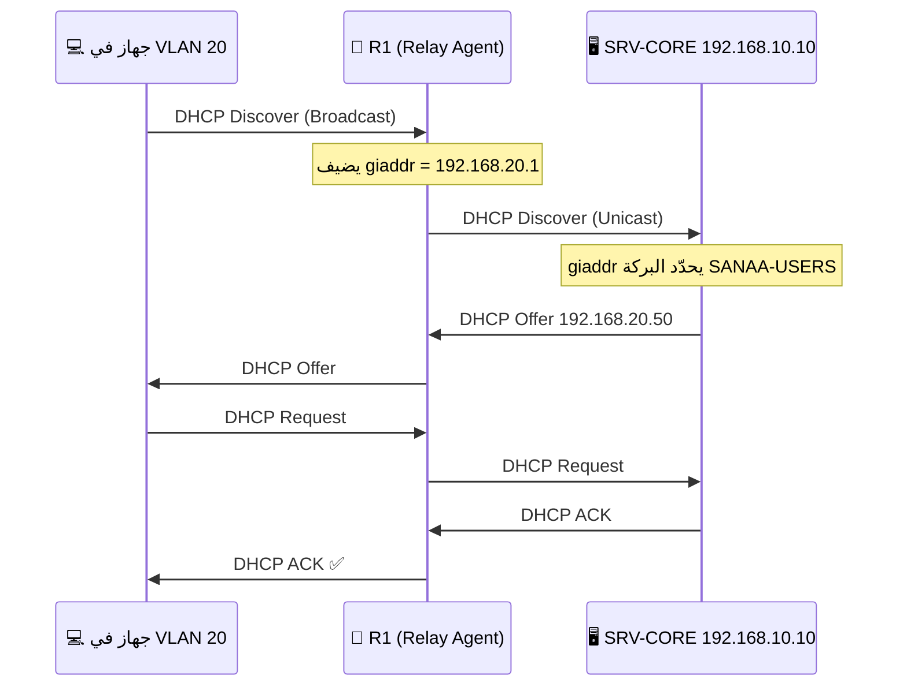

# 04 — خدمتا DHCP و DNS

في هذا المشروع نطبّق **الطريقتين** لتوزيع العناوين حتى يظهر الفهم الكامل:

| المدينة | طريقة الـ DHCP | الملاحظة |
|---|---|---|
| **صنعاء** | سيرفر DHCP مركزي + `ip helper-address` على الراوتر | الطريقة المؤسسية |
| **عدن** | الراوتر نفسه هو سيرفر DHCP | الطريقة المبسّطة للفروع |

---

## الجزء الأول: DHCP في صنعاء (سيرفر مركزي)

### 1) إعداد عنوان السيرفر `SRV-CORE`

اضغط على السيرفر ← **Desktop** ← **IP Configuration** ← اختر **Static**:

| الحقل | القيمة |
|---|---|
| IPv4 Address | `192.168.10.10` |
| Subnet Mask | `255.255.255.0` |
| Default Gateway | `192.168.10.1` |
| DNS Server | `192.168.10.10` |

### 2) تفعيل خدمة DHCP

اضغط على السيرفر ← تبويب **Services** ← **DHCP** ← اجعل **Service = On**

أنشئ **بركتين** (Pools) — بعد تعبئة كل واحدة اضغط **Add** ثم **Save**:

**البركة الأولى — مستخدمو صنعاء:**

| الحقل | القيمة |
|---|---|
| Pool Name | `SANAA-USERS` |
| Default Gateway | `192.168.20.1` |
| DNS Server | `192.168.10.10` |
| Start IP Address | `192.168.20.50` |
| Subnet Mask | `255.255.255.0` |
| Maximum Number of Users | `200` |

**البركة الثانية — أجهزة إنترنت الأشياء:**

| الحقل | القيمة |
|---|---|
| Pool Name | `SANAA-IOT` |
| Default Gateway | `192.168.30.1` |
| DNS Server | `192.168.10.10` |
| Start IP Address | `192.168.30.50` |
| Subnet Mask | `255.255.255.0` |
| Maximum Number of Users | `200` |

> ⚠️ **لا تحذف البركة `serverPool` الافتراضية** — فقط اتركها، أو اجعلها فارغة.
> حذفها أحيانًا يسبّب سلوكًا غريبًا في بعض إصدارات Packet Tracer.

### 3) لماذا نحتاج `ip helper-address`؟

طلب الـ DHCP يُرسَل كـ **Broadcast**، والراوتر **لا يمرّر البث** بين الشبكات.
لذلك نخبر الراوتر: «حين يصلك طلب DHCP على هذا المنفذ، حوّله كـ Unicast إلى السيرفر».

هذا الأمر مكتوب مسبقًا في إعداد R1 في [ملف 03](03-routing-wan.md):

```cisco
interface GigabitEthernet0/0.20
 ip helper-address 192.168.10.10
!
interface GigabitEthernet0/0.30
 ip helper-address 192.168.10.10
```



---

## الجزء الثاني: DHCP في عدن (من الراوتر مباشرة)

على الراوتر **R2-ADEN**:

```cisco
enable
configure terminal
!
! ===== حجز العناوين الثابتة =====
ip dhcp excluded-address 172.16.20.1 172.16.20.49
ip dhcp excluded-address 172.16.30.1 172.16.30.49
ip dhcp excluded-address 172.16.40.1 172.16.40.49
!
! ===== بركة مستخدمي عدن =====
ip dhcp pool ADEN-USERS
 network 172.16.20.0 255.255.255.0
 default-router 172.16.20.1
 dns-server 192.168.10.10
 domain-name smartcity.local
 lease 7
 exit
!
! ===== بركة أجهزة IoT في المستودع =====
ip dhcp pool ADEN-IOT
 network 172.16.30.0 255.255.255.0
 default-router 172.16.30.1
 dns-server 192.168.10.10
 domain-name smartcity.local
 exit
!
! ===== بركة شبكة برج الاتصالات =====
ip dhcp pool CELL-POOL
 network 172.16.40.0 255.255.255.0
 default-router 172.16.40.1
 dns-server 192.168.10.10
 exit
!
end
write memory
```

**للتحقق:**

```cisco
show ip dhcp pool
show ip dhcp binding
show ip dhcp conflict
```

---

## الجزء الثالث: خدمة DNS

### 1) تفعيل الخدمة

على السيرفر `SRV-CORE` ← تبويب **Services** ← **DNS** ← **Service = On**

### 2) إضافة السجلات (Records)

لكل سطر: اكتب الاسم والعنوان، اختر النوع **A Record**، ثم اضغط **Add**:

| Name | Type | Address |
|---|---|---|
| `iot.smartcity.local` | A Record | `192.168.10.20` |
| `www.smartcity.local` | A Record | `192.168.10.40` |
| `aaa.smartcity.local` | A Record | `192.168.10.30` |
| `dhcp.smartcity.local` | A Record | `192.168.10.10` |
| `aden.smartcity.local` | A Record | `172.16.10.10` |
| `smartcity.local` | A Record | `192.168.10.40` |

### 3) سجل CNAME (اختياري — يعطي درجة إضافية)

| Name | Type | Host Name |
|---|---|---|
| `portal.smartcity.local` | CNAME | `iot.smartcity.local` |

### 4) لماذا DNS مهم في مشروع IoT؟

بدل أن يحفظ المستخدم `192.168.10.20` ليفتح لوحة التحكم، يكتب
**`iot.smartcity.local`**. وإذا تغيّر عنوان السيرفر لاحقًا، نعدّل سجلًا واحدًا
في الـ DNS بدل تعديل كل جهاز.

---

## الجزء الرابع: اختبار الخدمتين

### اختبار DHCP

على أي جهاز PC ← **Desktop** ← **IP Configuration** ← اختر **DHCP**

يجب أن تظهر رسالة: `DHCP request successful` مع عنوان من البركة الصحيحة.

على الـ Command Prompt للجهاز:

```
ipconfig /all
ipconfig /release
ipconfig /renew
```

### اختبار DNS

```
nslookup iot.smartcity.local
ping iot.smartcity.local
ping www.smartcity.local
```

النتيجة المتوقعة من `nslookup`:

```
Server:  [192.168.10.10]
Address: 192.168.10.10

Name:    iot.smartcity.local
Address: 192.168.10.20
```

ثم افتح **Desktop → Web Browser** واكتب `http://iot.smartcity.local`
— يجب أن تفتح صفحة سيرفر إنترنت الأشياء.

---

## أخطاء شائعة

| المشكلة | السبب | الحل |
|---|---|---|
| الجهاز يأخذ `169.254.x.x` | لم يصل لسيرفر DHCP | تأكد من `ip helper-address` ومن أن السيرفر Service = On |
| يأخذ عنوانًا من البركة الخطأ | الـ Default Gateway في البركة غير مطابق للـ subinterface | صحّح الـ Default Gateway داخل البركة |
| `ping IP` ينجح لكن `ping اسم` يفشل | الجهاز ما عنده DNS Server | تأكد أن البركة تُرسل `192.168.10.10` كـ DNS |
| `nslookup` يعطي `Non-existent domain` | السجل غير مضاف أو فيه خطأ إملائي | راجع تبويب DNS في السيرفر |
| DNS يعمل في صنعاء ولا يعمل في عدن | مشكلة توجيه، لا مشكلة DNS | جرّب `ping 192.168.10.10` من عدن أولًا |

---

**التالي:** [05 — اللاسلكي و WPA2 و AAA](05-wireless-wpa2-aaa.md)
