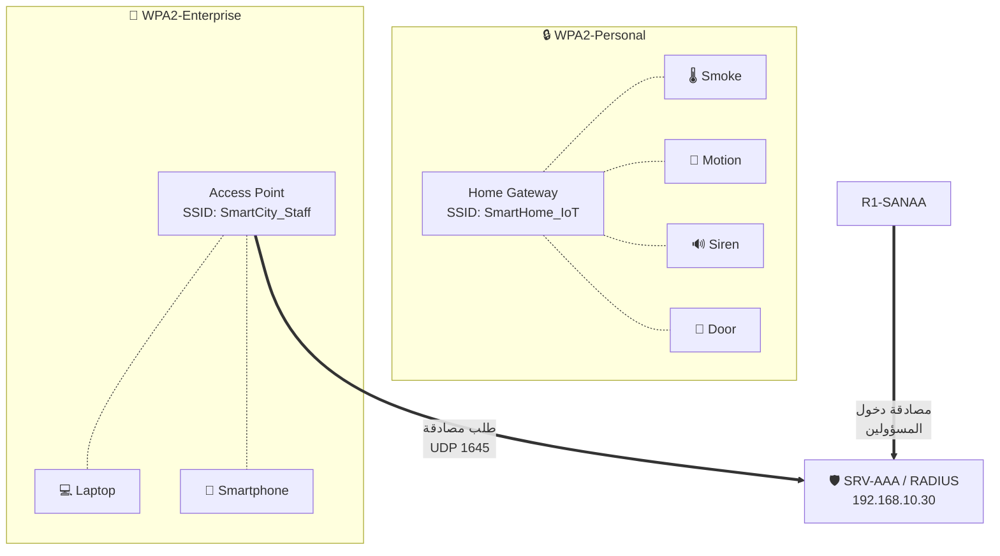

# 05 — الربط اللاسلكي: WPA2 و AAA (RADIUS)

في المشروع ثلاث شبكات لاسلكية، كل واحدة بمستوى حماية مختلف:

| SSID | نوع الحماية | الأجهزة | الغرض |
|---|---|---|---|
| `SmartHome_IoT` | **WPA2-Personal (PSK)** | Home Gateway | حساسات ومشغّلات البيت الذكي |
| `SmartCity_Staff` | **WPA2-Enterprise + RADIUS** | Access Point | لابتوبات وهواتف الموظفين |
| `Warehouse_IoT` | **WPA2-Personal (PSK)** | Home Gateway في عدن | حساسات المستودع |



---

## الجزء الأول: WPA2-Personal على الـ Home Gateway

الـ **Home Gateway** هو قلب البيت الذكي — كل أجهزة IoT ستتصل به لاسلكيًا.

### 1) الإعداد

اضغط على `HOME-GW` ← تبويب **Config** ← **Wireless**:

| الحقل | القيمة |
|---|---|
| SSID | `SmartHome_IoT` |
| 2.4 GHz Channel | `6` |
| Authentication | ✅ **WPA2-PSK** |
| PSK Pass Phrase | `IoT@Home2024` |
| Encryption Type | `AES` |

ثم **Config → Internet**: اختر **DHCP** ← سيأخذ عنوانًا من VLAN 30
(`192.168.30.x`) عبر الـ helper-address الذي أعددناه.

ثم **Config → LAN**: اتركه كما هو (`192.168.25.1 / 255.255.255.0`)،
وهو يوزّع DHCP داخليًا لأجهزة IoT.

### 2) توصيل جهاز IoT بالشبكة اللاسلكية

كل جهاز Smart Thing (حساس أو مشغّل):

1. اضغط عليه ← تبويب **Config** ← **Wireless0**
2. اختر **SSID** = `SmartHome_IoT`
3. Authentication = **WPA2-PSK** ← PSK Pass Phrase = `IoT@Home2024`
4. IP Configuration = **DHCP**

> **إذا كان الجهاز يظهر بمنفذ سلكي فقط:** اضغط عليه ← **Physical** ← أطفئه ←
> اسحب الوحدة **`PT-IOT-NM-1W`** (وحدة واي فاي) ← شغّله. بعدها يظهر `Wireless0`.

---

## الجزء الثاني: سيرفر AAA / RADIUS

### 1) عنوان السيرفر

`SRV-AAA` ← **Desktop → IP Configuration → Static**:

| الحقل | القيمة |
|---|---|
| IPv4 Address | `192.168.10.30` |
| Subnet Mask | `255.255.255.0` |
| Default Gateway | `192.168.10.1` |
| DNS Server | `192.168.10.10` |

### 2) تفعيل خدمة AAA

`SRV-AAA` ← تبويب **Services** ← **AAA**:

| الحقل | القيمة |
|---|---|
| Service | **On** |
| Radius Port | `1645` |

### 3) إضافة العملاء (Network Configuration)

هؤلاء هم الأجهزة المسموح لها بسؤال سيرفر RADIUS. أضف كل سطر ثم **Add**:

| Client Name | Client IP | Secret | ServerType |
|---|---|---|---|
| `AP-STAFF` | `192.168.30.2` | `Radius@123` | Radius |
| `R1-SANAA` | `192.168.10.1` | `Radius@123` | Radius |
| `R2-ADEN` | `10.0.0.6` | `Radius@123` | Radius |
| `SW1-SANAA` | `192.168.99.2` | `Radius@123` | Radius |

> 💡 إذا فشلت مصادقة اللاسلكي، أضف إدخالًا إضافيًا بعنوان بوابة الـ IoT
> `192.168.30.1` بنفس الـ Secret. المطابقة الأهم في Packet Tracer هي على
> **الـ Shared Secret**، فاحرص أن يكون متطابقًا حرفًا بحرف في كل المواضع.

### 4) إضافة المستخدمين (User Setup)

| Username | Password |
|---|---|
| `mohammed` | `Pass@1234` |
| `ahmed` | `Pass@1234` |
| `admin` | `Admin@123` |
| `guest` | `Guest@123` |

---

## الجزء الثالث: WPA2-Enterprise على الـ Access Point

### 1) إعداد الـ AP

اضغط على `AP-STAFF` ← تبويب **Config** ← **Port 1**:

| الحقل | القيمة |
|---|---|
| SSID | `SmartCity_Staff` |
| Channel | `11` |
| Authentication | ✅ **WPA2** |
| RADIUS Server IP | `192.168.10.30` |
| Shared Secret | `Radius@123` |
| Encryption Type | `AES` |

الـ AP يُوصَل بالسويتش `SW1` على منفذ في **VLAN 30** بكابل
**Copper Straight-Through**.

### 2) إعداد اللابتوب للاتصال

اللابتوب يحتاج بطاقة لاسلكية:

1. اضغط على اللابتوب ← **Physical** ← أطفئه
2. اسحب بطاقة `WPC300N` (أو `PT-LAPTOP-NM-1W`) إلى الفتحة
3. شغّله

ثم: **Desktop → PC Wireless → Connect**:

- اختر `SmartCity_Staff` ← **Connect**
- Security = **WPA2-Enterprise**
- User Name: `mohammed`
- Password: `Pass@1234`
- اضغط **Connect**

ثم **Desktop → IP Configuration → DHCP**.

---

## الجزء الرابع: AAA لحماية دخول الراوترات

هذا يوضّح الفائدة الثانية للـ AAA: بدل كلمة سر محلية على كل راوتر،
كل المسؤولين يُصادَقون من سيرفر واحد.

على **R1-SANAA**:

```cisco
enable
configure terminal
!
! ===== تفعيل نموذج AAA =====
aaa new-model
!
! ===== تعريف سيرفر RADIUS =====
radius server RAD-SRV
 address ipv4 192.168.10.30 auth-port 1645 acct-port 1646
 key Radius@123
 exit
!
! ===== قائمة المصادقة: جرّب RADIUS، وإن فشل استخدم الحساب المحلي =====
aaa authentication login LOGIN-LIST group radius local
!
! حساب محلي احتياطي (مهم جدًا حتى لا تُقفَل خارج الراوتر)
username admin secret Admin@123
!
line console 0
 login authentication LOGIN-LIST
 exit
!
line vty 0 4
 login authentication LOGIN-LIST
 transport input ssh
 exit
!
end
write memory
```

> ⚠️ **كلمة `local` في نهاية السطر ليست اختيارية.** لو سقط سيرفر RADIUS
> بدونها، لن تستطيع الدخول إلى الراوتر إطلاقًا.

### التحقق

```cisco
show aaa servers
show radius statistics
show running-config | section aaa
```

**اختبار عملي:** من جهاز PC ← **Desktop → Telnet/SSH**:

```
ssh -l mohammed 192.168.10.1
```
كلمة المرور `Pass@1234` ← يجب أن يدخل، والمصادقة تمت من سيرفر RADIUS ✅

---

## الجزء الخامس: مقارنة أنواع الحماية (لتقرير المشروع)

| | WEP | WPA | **WPA2-Personal** | **WPA2-Enterprise** |
|---|---|---|---|---|
| التشفير | RC4 (40/104 bit) | TKIP | **AES-CCMP** | **AES-CCMP** |
| المفتاح | ثابت مشترك | مشترك | مشترك (PSK) | **حساب لكل مستخدم** |
| المصادقة | لا يوجد | PSK | PSK | **802.1X + RADIUS** |
| عند خروج موظف | تغيير المفتاح للجميع | نفس المشكلة | نفس المشكلة | **حذف حسابه فقط** |
| الأمان | مكسور تمامًا ❌ | ضعيف | **قوي ✅** | **الأقوى ✅✅** |
| الاستخدام هنا | — | — | أجهزة IoT | الموظفون |

**لماذا استخدمنا الاثنين معًا؟**
أجهزة إنترنت الأشياء بسيطة ولا تدعم حسابات فردية، فتناسبها WPA2-PSK.
أما الموظفون فلكل واحد هوية، لذلك WPA2-Enterprise أنسب — ويمكن تتبّع
من دخل الشبكة ومتى.

---

## أخطاء شائعة

| المشكلة | السبب | الحل |
|---|---|---|
| جهاز IoT لا يتصل بالـ Home Gateway | كلمة PSK مختلفة حرفًا واحدًا | أعد كتابتها في الجهازين |
| اللابتوب لا يرى الـ SSID | لا توجد بطاقة لاسلكية أو الـ AP مطفأ | ركّب `WPC300N` وتأكد أن AP موصول |
| WPA2-Enterprise يرفض الدخول | الـ Shared Secret مختلف أو العميل غير مضاف | راجع Network Configuration في سيرفر AAA |
| `aaa new-model` أقفلني خارج الراوتر | نسيت `local` في قائمة المصادقة | أعد التشغيل واستخدم Password Recovery |
| الجهاز اللاسلكي متصل لكن بلا IP | الـ Home Gateway لم يأخذ عنوان من الأعلى | تأكد أن منفذ Internet = DHCP وأن VLAN 30 يعمل |

---

**التالي:** [06 — حساسات إنترنت الأشياء](06-iot-sensors-actuators.md)
