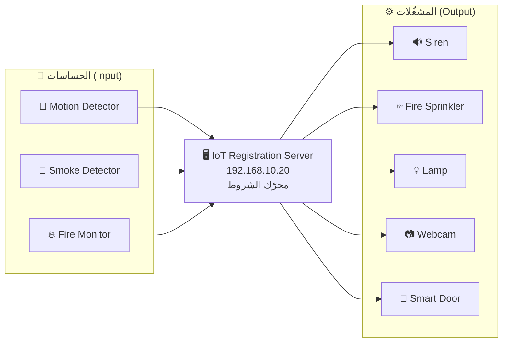

# 06 — حساسات إنترنت الأشياء: الحركة، الدخان، الحريق، والسايرن

هذا هو قلب المشروع: أجهزة تستشعر البيئة، وسيرفر يقرّر، ومشغّلات تنفّذ.



---

## الجزء الأول: تجهيز سيرفر إنترنت الأشياء

### 1) عنوان السيرفر

`SRV-IOT` ← **Desktop → IP Configuration → Static**:

| الحقل | القيمة |
|---|---|
| IPv4 Address | `192.168.10.20` |
| Subnet Mask | `255.255.255.0` |
| Default Gateway | `192.168.10.1` |
| DNS Server | `192.168.10.10` |

### 2) تفعيل خدمة التسجيل

`SRV-IOT` ← تبويب **Services** ← **IoT** ← **Registration Server = On**

### 3) إنشاء الحساب

من أي جهاز PC ← **Desktop → Web Browser** ← اكتب:

```
http://192.168.10.20
```
أو `http://iot.smartcity.local` بعد إعداد DNS.

اضغط **Sign up now** وأنشئ:

| الحقل | القيمة |
|---|---|
| Username | `admin` |
| Password | `admin123` |

---

## الجزء الثاني: ربط الأجهزة بالسيرفر

لكل جهاز IoT (حساس أو مشغّل)، بعد اتصاله بالشبكة اللاسلكية:

1. اضغط على الجهاز ← تبويب **Config** ← **Settings**
2. تحت **IoT Server** اختر **Remote Server**
3. املأ:

| الحقل | القيمة |
|---|---|
| Server Address | `192.168.10.20` |
| User Name | `admin` |
| Password | `admin123` |

4. اضغط **Connect** ← يجب أن تتحول الحالة إلى **Connected** ✅

كرّر ذلك لكل الأجهزة، ثم افتح المتصفح على `http://192.168.10.20` —
ستجد كل الأجهزة مسرودة في القائمة.

> **إن ظهرت "Connection Failed":** جرّب `ping 192.168.10.20` من الجهاز نفسه.
> غالبًا المشكلة في الشبكة (Gateway أو VLAN) وليست في إعداد الـ IoT.

---

## الجزء الثالث: قائمة الأجهزة وأماكنها

### البيت الذكي — صنعاء

| الجهاز | المسار في Packet Tracer | الاسم في المشروع |
|---|---|---|
| Motion Detector | `End Devices → Home → Motion Detector` | `MOTION-LIVING` |
| Smoke Detector | `End Devices → Home → Smoke Detector` | `SMOKE-KITCHEN` |
| Fire Monitor | `End Devices → Home → Fire Monitor` | `FIRE-KITCHEN` |
| Siren | `End Devices → Home → Siren` | `SIREN-HOME` |
| Fire Sprinkler | `End Devices → Home → Fire Sprinkler` | `SPRINKLER-KITCHEN` |
| Lamp | `End Devices → Home → Lamp` | `LAMP-LIVING` |
| Webcam | `End Devices → Home → Webcam` | `CAM-ENTRANCE` |
| Smart Door | `End Devices → Home → Door` | `DOOR-MAIN` |
| Ceiling Fan | `End Devices → Home → Ceiling Fan` | `FAN-LIVING` |

### المستودع الذكي — عدن

| الجهاز | الاسم |
|---|---|
| Smoke Detector | `SMOKE-WH` |
| Fire Monitor | `FIRE-WH` |
| Motion Detector | `MOTION-WH-GATE` |
| Siren | `SIREN-WH` |
| Fire Sprinkler | `SPRINKLER-WH` |

---

## الجزء الرابع: كتابة شروط الأتمتة (Conditions)

هذا الجزء هو **العقل المدبّر** للمشروع.

افتح المتصفح على `http://192.168.10.20` ← سجّل الدخول ← تبويب **Conditions**
← **Add** لكل شرط.

### 🔥 شروط الحريق والدخان

**الشرط 1 — تشغيل السايرن عند الدخان**

| الحقل | القيمة |
|---|---|
| Name | `SMOKE-ALARM-ON` |
| Enabled | ✅ |
| **If** | `SMOKE-KITCHEN` › `Level` › `>` › `0.5` |
| **Then** | Set `SIREN-HOME` › `On` › to `true` |

**الشرط 2 — إطفاء السايرن عند زوال الدخان**

| الحقل | القيمة |
|---|---|
| Name | `SMOKE-ALARM-OFF` |
| **If** | `SMOKE-KITCHEN` › `Level` › `<=` › `0.5` |
| **Then** | Set `SIREN-HOME` › `On` › to `false` |

**الشرط 3 — تشغيل مرشّات الإطفاء عند اكتشاف نار**

| الحقل | القيمة |
|---|---|
| Name | `FIRE-SPRINKLER-ON` |
| **If** | `FIRE-KITCHEN` › `Fire Detected` › `is` › `true` |
| **Then** | Set `SPRINKLER-KITCHEN` › `Status` › to `On` |

**الشرط 4 — فتح الباب تلقائيًا للإخلاء** ⭐ *(نقطة قوية في المشروع)*

| الحقل | القيمة |
|---|---|
| Name | `FIRE-UNLOCK-DOOR` |
| **If** | `FIRE-KITCHEN` › `Fire Detected` › `is` › `true` |
| **Then** | Set `DOOR-MAIN` › `Lock` › to `Unlock` |

**الشرط 5 — إضاءة مسار الهروب**

| الحقل | القيمة |
|---|---|
| Name | `FIRE-EMERGENCY-LIGHT` |
| **If** | `SMOKE-KITCHEN` › `Level` › `>` › `0.5` |
| **Then** | Set `LAMP-LIVING` › `Status` › to `On` |

### 🚶 شروط مستشعر الحركة

**الشرط 6 — إضاءة تلقائية عند الحركة**

| الحقل | القيمة |
|---|---|
| Name | `MOTION-LIGHT-ON` |
| **If** | `MOTION-LIVING` › `On` › `is` › `true` |
| **Then** | Set `LAMP-LIVING` › `Status` › to `On` |

**الشرط 7 — إطفاء الإضاءة عند انعدام الحركة**

| الحقل | القيمة |
|---|---|
| Name | `MOTION-LIGHT-OFF` |
| **If** | `MOTION-LIVING` › `On` › `is` › `false` |
| **Then** | Set `LAMP-LIVING` › `Status` › to `Off` |

**الشرط 8 — تشغيل الكاميرا عند الحركة**

| الحقل | القيمة |
|---|---|
| Name | `MOTION-CAMERA-ON` |
| **If** | `MOTION-LIVING` › `On` › `is` › `true` |
| **Then** | Set `CAM-ENTRANCE` › `On` › to `true` |

**الشرط 9 — إنذار تسلل في المستودع (عدن)** ⭐

| الحقل | القيمة |
|---|---|
| Name | `WH-INTRUSION-ALERT` |
| **If** | `MOTION-WH-GATE` › `On` › `is` › `true` |
| **Then** | Set `SIREN-WH` › `On` › to `true` |

> هذا الشرط يثبت أن **الربط بين المدن يعمل**: الحساس في عدن، والسيرفر في
> صنعاء، والقرار يعبر شبكة الـ WAN ذهابًا وإيابًا.

### 📊 جدول ملخّص كل الشروط

| # | الاسم | الحساس | الشرط | المشغّل | النتيجة |
|---|---|---|---|---|---|
| 1 | SMOKE-ALARM-ON | Smoke | Level > 0.5 | Siren | On |
| 2 | SMOKE-ALARM-OFF | Smoke | Level ≤ 0.5 | Siren | Off |
| 3 | FIRE-SPRINKLER-ON | Fire | Detected = true | Sprinkler | On |
| 4 | FIRE-UNLOCK-DOOR | Fire | Detected = true | Door | Unlock |
| 5 | FIRE-EMERGENCY-LIGHT | Smoke | Level > 0.5 | Lamp | On |
| 6 | MOTION-LIGHT-ON | Motion | On = true | Lamp | On |
| 7 | MOTION-LIGHT-OFF | Motion | On = false | Lamp | Off |
| 8 | MOTION-CAMERA-ON | Motion | On = true | Webcam | On |
| 9 | WH-INTRUSION-ALERT | Motion (عدن) | On = true | Siren (عدن) | On |

---

## الجزء الخامس: كيف تختبر الحساسات؟

في Packet Tracer تُحاكي الأحداث الفيزيائية بالضغط على **`Alt`** + النقر
على الجهاز:

| الحساس | طريقة التفعيل | النتيجة المتوقعة |
|---|---|---|
| **Motion Detector** | اضغط `Alt` + انقر على الحساس | المصباح يضيء + الكاميرا تعمل |
| **Smoke Detector** | ضع بجواره **Fire** من `Components → Home` ثم `Alt`+نقر عليها | مؤشّر الدخان يرتفع ← السايرن يعمل |
| **Fire Monitor** | نفس طريقة الدخان | المرشّات تعمل + الباب يُفتح |
| **Siren** | يعمل تلقائيًا من الشروط | صوت وحركة على أيقونته |

> **طريقة بديلة للدخان:** اضغط على الحساس ← تبويب **Physical/Specifications**
> وحرّك المؤشّر يدويًا لرفع مستوى الدخان.

---

## الجزء السادس: البرمجة بدل الشروط (اختياري — يرفع تقييم المشروع)

الشروط في السيرفر سهلة لكنها محدودة. البرمجة على **MCU** تعطي منطقًا أذكى
(مثلًا: لا تُشغّل السايرن إلا إذا استمر الدخان 3 ثوانٍ — لتجنّب الإنذارات الكاذبة).

راجع مجلد [`code/`](code/):

| الملف | الوظيفة |
|---|---|
| [`smoke_siren_mcu.py`](code/smoke_siren_mcu.py) | دخان + سايرن مع تأخير مضاد للإنذار الكاذب |
| [`motion_light_mcu.py`](code/motion_light_mcu.py) | حركة + إضاءة مع مؤقّت إطفاء |
| [`fire_system_mcu.py`](code/fire_system_mcu.py) | نظام حريق متكامل (سايرن + مرشّات + باب) |

**كيف تضع الكود في Packet Tracer:**

1. اسحب جهاز **MCU** من `Components → Boards → MCU-PT`
2. وصّل الحساس بمنفذ `D0`/`A0` والمشغّل بمنفذ `D1` بكابل **IoT Custom Cable**
3. اضغط على الـ MCU ← تبويب **Programming**
4. **New** ← اختر القالب **Empty - Python** ← سمّه `main.py`
5. الصق الكود ← اضغط **Run** ▶

---

## أخطاء شائعة

| المشكلة | السبب | الحل |
|---|---|---|
| الجهاز لا يظهر في قائمة السيرفر | لم يُسجَّل | Config → Settings → Remote Server → Connect |
| الشرط لا ينفّذ | مكتوب في `Conditions` لكن `Enabled` غير مفعّل | فعّل مربع Enabled |
| السايرن يشتغل ولا يتوقف أبدًا | كتبت شرط التشغيل ونسيت شرط الإيقاف | أضف الشرط المعاكس (2) |
| قيمة `Level > 0.5` لا تتحقق | مقياس الدخان مختلف في نسختك | افتح الحساس وراقب القيمة الفعلية ثم اضبط العتبة |
| الحساس في عدن لا يتصل بالسيرفر | مشكلة توجيه WAN | `ping 192.168.10.20` من جهاز في عدن |

---

**التالي:** [07 — نظام RFID للتحكم بالدخول](07-rfid-access-control.md)
