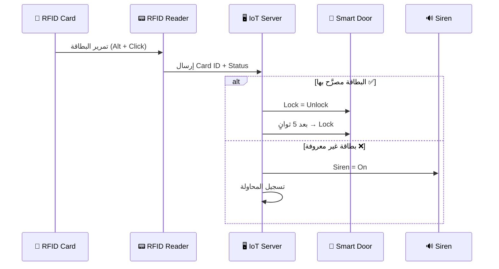

# 07 — نظام RFID للتحكم بالدخول

الهدف: بوابة ذكية لا تُفتح إلا لحاملي بطاقة RFID مصرَّح بها، مع تسجيل
محاولات الدخول غير المصرَّح بها وتشغيل الإنذار.

---

## 1) الأجهزة المطلوبة

| الجهاز | المسار في Packet Tracer | الاسم |
|---|---|---|
| قارئ RFID | `End Devices → Smart City → RFID Reader` | `RFID-GATE` |
| بطاقة RFID ×3 | `End Devices → Smart City → RFID Card` | `CARD-MOHAMMED` / `CARD-AHMED` / `CARD-VISITOR` |
| باب ذكي | `End Devices → Home → Door` | `DOOR-MAIN` |
| صفارة إنذار | `End Devices → Home → Siren` | `SIREN-HOME` |
| كاميرا | `End Devices → Home → Webcam` | `CAM-ENTRANCE` |

> في بعض إصدارات Packet Tracer تجد الـ RFID تحت
> `End Devices → Home` أو ضمن `Components → Smart City`.
> استخدم مربع البحث أسفل يسار البرنامج واكتب `RFID`.

---

## 2) ربط القارئ بالشبكة

`RFID-GATE` ← تبويب **Config**:

**أ) اللاسلكي — Wireless0:**

| الحقل | القيمة |
|---|---|
| SSID | `SmartHome_IoT` |
| Authentication | WPA2-PSK |
| PSK Pass Phrase | `IoT@Home2024` |
| IP Configuration | DHCP |

**ب) الاتصال بسيرفر إنترنت الأشياء — Settings:**

| الحقل | القيمة |
|---|---|
| IoT Server | Remote Server |
| Server Address | `192.168.10.20` |
| User Name | `admin` |
| Password | `admin123` |

اضغط **Connect** ← الحالة `Connected` ✅

كرّر نفس الخطوات مع `DOOR-MAIN` و `SIREN-HOME` و `CAM-ENTRANCE`.

---

## 3) معرفة أرقام البطاقات (Card ID)

كل بطاقة لها رقم فريد. لمعرفته:

1. اضغط على البطاقة ← تبويب **Config** ← **Settings**
2. ستجد حقل **`Card ID`** — سجّل الرقم

أو من لوحة تحكم السيرفر: افتح `http://192.168.10.20` ← اضغط على `RFID-GATE`
← مرّر بطاقة ← سيظهر الـ ID في خصائص القارئ.

**جدول البطاقات في المشروع** (استبدل الأرقام بما يظهر عندك):

| البطاقة | الاسم | Card ID | الصلاحية |
|---|---|---|---|
| `CARD-MOHAMMED` | محمد — مدير | `1001` | ✅ مصرَّح |
| `CARD-AHMED` | أحمد — موظف | `1002` | ✅ مصرَّح |
| `CARD-VISITOR` | زائر | `9999` | ❌ غير مصرَّح |

---

## 4) شروط التحكم بالبوابة

من لوحة السيرفر ← تبويب **Conditions** ← **Add**:

**الشرط 10 — فتح الباب لبطاقة محمد**

| الحقل | القيمة |
|---|---|
| Name | `RFID-OPEN-MOHAMMED` |
| Enabled | ✅ |
| **If** | `RFID-GATE` › `Card ID` › `==` › `1001` |
| **Then** | Set `DOOR-MAIN` › `Lock` › to `Unlock` |

**الشرط 11 — فتح الباب لبطاقة أحمد**

| الحقل | القيمة |
|---|---|
| Name | `RFID-OPEN-AHMED` |
| **If** | `RFID-GATE` › `Card ID` › `==` › `1002` |
| **Then** | Set `DOOR-MAIN` › `Lock` › to `Unlock` |

**الشرط 12 — إنذار عند بطاقة غير مصرَّح بها** ⭐

| الحقل | القيمة |
|---|---|
| Name | `RFID-DENY-ALARM` |
| **If** | `RFID-GATE` › `Card ID` › `==` › `9999` |
| **Then** | Set `SIREN-HOME` › `On` › to `true` |

**الشرط 13 — تصوير كل محاولة دخول**

| الحقل | القيمة |
|---|---|
| Name | `RFID-CAMERA-RECORD` |
| **If** | `RFID-GATE` › `Status` › `is` › `Detected` |
| **Then** | Set `CAM-ENTRANCE` › `On` › to `true` |

**الشرط 14 — إغلاق الباب عند إبعاد البطاقة**

| الحقل | القيمة |
|---|---|
| Name | `RFID-CLOSE-DOOR` |
| **If** | `RFID-GATE` › `Status` › `is` › `Not Detected` |
| **Then** | Set `DOOR-MAIN` › `Lock` › to `Lock` |

---

## 5) الاختبار

1. اسحب البطاقة `CARD-MOHAMMED` بجانب القارئ `RFID-GATE`
2. اضغط **`Alt` + نقرة** على البطاقة
3. يجب أن:
   - تتغيّر حالة القارئ إلى **Detected**
   - يظهر الـ Card ID في القارئ
   - **ينفتح الباب** 🚪✅
   - تعمل الكاميرا 📷

4. جرّب `CARD-VISITOR` ← يجب أن **يعمل السايرن** ولا ينفتح الباب ❌

---

## 6) البديل المتقدّم: RFID عبر MCU مبرمَج

بدل الشروط الجاهزة، يمكن ربط القارئ بجهاز **MCU** وكتابة منطق أذكى:
عدّة بطاقات مصرَّح بها في قائمة واحدة، عدّاد محاولات فاشلة، وقفل مؤقّت
بعد 3 محاولات خاطئة.

الكود جاهز في [`code/rfid_door_mcu.py`](code/rfid_door_mcu.py).

---

## 7) الجانب الأمني — نقاط للتقرير

| النقطة | الشرح |
|---|---|
| **RFID وحده غير كافٍ** | البطاقة قابلة للنسخ (Cloning) — يُفضَّل إضافة PIN أو بصمة (Two-Factor) |
| **الشبكة المعزولة** | وضعنا أجهزة IoT في VLAN 30 منفصلة، فلو اختُرق القارئ لا يصل للسيرفرات |
| **التشفير** | الاتصال اللاسلكي محمي بـ WPA2-AES، فلا يمكن التقاط الـ Card ID من الهواء |
| **التسجيل** | كل محاولة دخول تُشغّل الكاميرا، وهذا سجل مرئي للحوادث |
| **الطوارئ فوق الأمان** | شرط الحريق يفتح الباب تلقائيًا — سلامة الأرواح أولوية على منع الدخول |

---

## أخطاء شائعة

| المشكلة | السبب | الحل |
|---|---|---|
| القارئ لا يكتشف البطاقة | البطاقة بعيدة | قرّبها حتى تلامس القارئ تقريبًا ثم `Alt`+نقر |
| الشرط لا يعمل مع `Card ID` | القيمة نصية وليست رقمية | جرّب المقارنة بـ `is` بدل `==` أو ضع الرقم بين علامتي تنصيص |
| الباب ينفتح لأي بطاقة | كتبت الشرط على `Status` بدل `Card ID` | صحّح حقل الشرط |
| الباب لا يُغلق أبدًا | نسيت الشرط 14 | أضف شرط الإغلاق |

---

**التالي:** [08 — برج الاتصالات Cell Tower](08-cell-tower.md)
