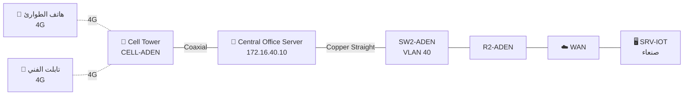

# 08 — برج الاتصالات Cell Tower والتغطية الخلوية

الهدف: تمكين هواتف فريق الطوارئ في **عدن** من مراقبة المستودع والتحكم
بأجهزته عبر شبكة **4G/LTE**، دون الحاجة لشبكة واي فاي — وهذا ما يجعل
المشروع «مدينة ذكية» لا مجرد «بيت ذكي».



---

## 1) الأجهزة المطلوبة

| الجهاز | المسار في Packet Tracer |
|---|---|
| Cell Tower | `Network Devices → WAN Emulation → Cell Tower` |
| Central Office Server | `Network Devices → WAN Emulation → Central Office Server` |
| Smartphone | `End Devices → End Devices → Smartphone` |
| Tablet | `End Devices → End Devices → Tablet` |

---

## 2) التوصيل

| من | المنفذ | إلى | المنفذ | نوع الكابل |
|---|---|---|---|---|
| `CELL-ADEN` (البرج) | `Coaxial0` | `CO-SERVER` | `Coaxial7` | **Coaxial** |
| `CO-SERVER` | `FastEthernet0` | `SW2-ADEN` | `Fa0/19` (VLAN 40) | **Copper Straight-Through** |

> **مهم:** الكابل بين البرج والـ Central Office Server هو **Coaxial فقط**.
> لن يقبل كابل نحاسي. اختره من قائمة الكابلات (أيقونة البرق ⚡).

---

## 3) إعداد الـ Central Office Server

اضغط على `CO-SERVER` ← **Config → FastEthernet0**:

| الحقل | القيمة |
|---|---|
| IP Configuration | Static |
| IPv4 Address | `172.16.40.10` |
| Subnet Mask | `255.255.255.0` |
| Default Gateway | `172.16.40.1` |
| DNS Server | `192.168.10.10` |

> الـ Central Office Server هنا يعمل كجسر (Bridge) بين شبكة الخلوي والشبكة
> السلكية. الهواتف المتصلة بالبرج ستأخذ عناوينها من **بركة `CELL-POOL`**
> على الراوتر `R2-ADEN` (أُعدَّت في [ملف 04](04-dhcp-dns.md)).

---

## 4) إعداد الهاتف الذكي

### أ) التأكد من وحدة الاتصال الخلوي

اضغط على `PHONE-EMERGENCY` ← تبويب **Physical**:
- يجب أن تكون الوحدة **`PT-MOBILE-NM-1W`** أو **3G/4G Cell** مركّبة
- إن لم تكن: أطفئ الجهاز ← اسحب الوحدة ← شغّله

### ب) تفعيل الشبكة الخلوية

`PHONE-EMERGENCY` ← **Config → Cell1** (أو `3G/4G Cell1`):
- Port Status: ✅ **On**
- IP Configuration: **DHCP**

يجب أن يظهر خط متقطّع بين الهاتف والبرج، ويحصل الهاتف على عنوان
`172.16.40.5x`.

### ج) التحقق

`PHONE-EMERGENCY` ← **Desktop → IP Configuration**:

```
IP Address    : 172.16.40.50
Subnet Mask   : 255.255.255.0
Default Gateway: 172.16.40.1
DNS Server    : 192.168.10.10
```

---

## 5) الاختبار الحاسم: التحكم عبر الشبكة الخلوية من مدينة لأخرى ⭐

هذا الاختبار يجمع **كل** عناصر المشروع في خطوة واحدة:

```
📱 هاتف على 4G في عدن
   → عبر Cell Tower
   → عبر Central Office Server
   → عبر SW2 و R2
   → عبر WAN بين المدن (OSPF)
   → إلى سيرفر IoT في صنعاء
   → للتحكم بسايرن في عدن!
```

**الخطوات:**

1. `PHONE-EMERGENCY` ← **Desktop → Command Prompt**:
   ```
   ping 192.168.10.20
   ping iot.smartcity.local
   ```

2. `PHONE-EMERGENCY` ← **Desktop → Web Browser** ← اكتب:
   ```
   http://iot.smartcity.local
   ```

3. سجّل الدخول بـ `admin` / `admin123`

4. من القائمة اضغط على `SIREN-WH` ← غيّر `On` إلى `true`
   ← **السايرن في مستودع عدن يعمل** 🔊

هذا يثبت في لقطة واحدة: DNS ✅ · DHCP ✅ · WAN بين المدن ✅ ·
Cell Tower ✅ · IoT Server ✅

---

## 6) سيناريو الطوارئ الكامل (للعرض أمام اللجنة)

اعرض هذا التسلسل مباشرة:

| الخطوة | الحدث | النتيجة |
|---|---|---|
| 1 | `Alt`+نقر على النار بجوار `SMOKE-WH` في مستودع عدن | مستوى الدخان يرتفع |
| 2 | الحساس يبلّغ سيرفر IoT في صنعاء عبر الـ WAN | الشرط يتحقق |
| 3 | السيرفر يأمر `SIREN-WH` بالعمل | 🔊 السايرن يعمل في عدن |
| 4 | السيرفر يأمر `SPRINKLER-WH` بالعمل | 💦 المرشّات تعمل |
| 5 | فني على هاتفه 4G يفتح `iot.smartcity.local` | يرى الحالة لحظيًا |
| 6 | الفني يطفئ السايرن من هاتفه بعد السيطرة | 🔇 السايرن يتوقف |

> صوّر هذا السيناريو بالفيديو أو بلقطات شاشة متسلسلة وضعه في التقرير.

---

## 7) ملاحظات تقنية

| النقطة | التوضيح |
|---|---|
| **البرج ليس راوترًا** | الـ Cell Tower طبقة فيزيائية فقط، والتوجيه يتم في `R2-ADEN` |
| **المدى** | في الوضع الفيزيائي للبرج مدى تغطية — إن ابتعد الهاتف كثيرًا ينقطع |
| **البديل** | جهاز `Cable Modem` + `Coaxial Splitter` يعطي محاكاة لشبكة الكيبل بدل الخلوي |
| **الحفظ** | إن لم يتصل الهاتف، احفظ الملف وأعد فتح Packet Tracer — أحيانًا الاتصال الخلوي يحتاج إعادة تحميل |

---

## أخطاء شائعة

| المشكلة | السبب | الحل |
|---|---|---|
| لا يظهر خط بين الهاتف والبرج | وحدة الخلوي غير مركّبة أو مطفأة | Config → Cell1 → Port Status = On |
| الهاتف لا يأخذ IP | بركة `CELL-POOL` غير معرّفة أو المنفذ في VLAN خطأ | راجع `show ip dhcp pool` على R2 وتأكد أن منفذ CO في VLAN 40 |
| كابل Coaxial مرفوض | تستخدم كابلًا نحاسيًا | اختر Coaxial من قائمة الكابلات |
| ping ينجح للراوتر ويفشل لصنعاء | مشكلة OSPF | `show ip route` على R2 وتأكد من وجود شبكات صنعاء |

---

**التالي:** [09 — الوضع الفيزيائي والخلفيات وترتيب الأسلاك](09-physical-mode.md)
