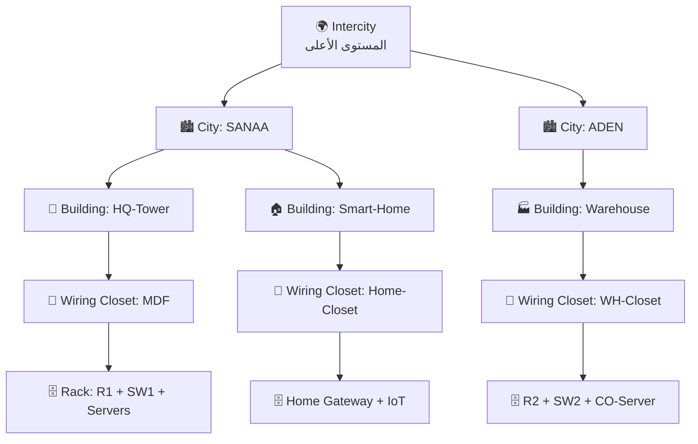

# 09 — الوضع الفيزيائي: توزيع الأجهزة، الخلفيات، وترتيب الأسلاك

الـ **Physical Workspace** هو ما يحوّل المشروع من «رسمة شبكة» إلى
**محاكاة واقعية** لمدينتين بمبانٍ وغرف اتصالات وخزائن (Racks) ومسافات حقيقية.
وهو غالبًا الجزء الذي يميّز مشروعك عن بقية المشاريع.

للانتقال إليه: اضغط زر **Physical** أعلى يسار الشاشة (بجانب Logical).

---

## 1) الهيكل الهرمي في الوضع الفيزيائي



| المستوى | ما يوضع فيه |
|---|---|
| **Intercity** | المدن، وروابط الـ WAN الطويلة بينها |
| **City** | المباني داخل المدينة |
| **Building** | غرف الاتصالات (Wiring Closets) |
| **Wiring Closet** | الـ Racks والأجهزة والأسلاك الفعلية |

---

## 2) بناء المدينتين خطوة بخطوة

### أ) إنشاء المدن

1. ادخل **Physical** ← ستجد نفسك في `Intercity` وبداخله `Home City` افتراضيًا
2. اضغط على `Home City` ← زر **`Rename`** أعلى الشاشة ← سمّها **`SANAA`**
3. ارجع لمستوى `Intercity` (زر **Back** أو مسار التنقّل أعلى الشاشة)
4. اضغط **`New City`** ← ستُنشأ مدينة جديدة ← سمّها **`ADEN`**
5. اسحب المدينتين لتباعدهما على الخريطة (صنعاء شمالًا، عدن جنوبًا)

### ب) إنشاء المباني

ادخل إلى `SANAA` ← اضغط **`New Building`**:

| المدينة | المباني |
|---|---|
| **SANAA** | `HQ-Tower` (المقر الرئيسي) · `Smart-Home` (البيت الذكي) |
| **ADEN** | `Warehouse` (المستودع) · `Cell-Site` (موقع البرج) |

### ج) إنشاء غرف الاتصالات

ادخل إلى كل مبنى ← اضغط **`New Closet`**:

| المبنى | غرفة الاتصالات |
|---|---|
| `HQ-Tower` | `MDF` (الغرفة الرئيسية) |
| `Smart-Home` | `Home-Closet` |
| `Warehouse` | `WH-Closet` |
| `Cell-Site` | `Tower-Closet` |

---

## 3) توزيع الأجهزة على المواقع

الأجهزة التي أنشأتها في الوضع Logical تكون كلها مكدّسة في مكان واحد.
لتوزيعها: ادخل الغرفة المطلوبة، اضغط زر **`Move Object`** أعلى الشاشة،
اختر الجهاز، ثم اختر الوجهة.

### الجدول المرجعي للتوزيع

| الجهاز | المدينة | المبنى | الغرفة |
|---|---|---|---|
| `R1-SANAA` | SANAA | HQ-Tower | MDF |
| `SW1-SANAA` | SANAA | HQ-Tower | MDF |
| `SRV-CORE` | SANAA | HQ-Tower | MDF |
| `SRV-IOT` | SANAA | HQ-Tower | MDF |
| `SRV-AAA` | SANAA | HQ-Tower | MDF |
| `AP-STAFF` | SANAA | HQ-Tower | MDF |
| `HOME-GW` | SANAA | Smart-Home | Home-Closet |
| كل حساسات ومشغّلات البيت | SANAA | Smart-Home | Home-Closet |
| `RFID-GATE` + البطاقات | SANAA | Smart-Home | Home-Closet |
| `R2-ADEN` | ADEN | Warehouse | WH-Closet |
| `SW2-ADEN` | ADEN | Warehouse | WH-Closet |
| `WAREHOUSE-GW` | ADEN | Warehouse | WH-Closet |
| حساسات المستودع | ADEN | Warehouse | WH-Closet |
| `CELL-ADEN` (البرج) | ADEN | Cell-Site | خارج المبنى |
| `CO-SERVER` | ADEN | Cell-Site | Tower-Closet |
| `R-ISP` | Intercity | — | يوضع بين المدينتين |

---

## 4) استخدام الـ Racks (الخزائن) — الاحترافية الحقيقية

داخل كل غرفة اتصالات:

1. من القائمة السفلية اسحب **`Rack`** إلى وسط الغرفة
2. اسحب الراوتر والسويتش والسيرفرات **إلى داخل الرف** — سيلتصق كل جهاز
   في وحدة (Unit) من الرف
3. الترتيب الاحترافي من أعلى لأسفل:

```
┌─────────────────────────────┐
│  Patch Panel                │  ← لوحة التوصيل
├─────────────────────────────┤
│  R1-SANAA   (Router)        │  ← الطبقة 3
├─────────────────────────────┤
│  SW1-SANAA  (Switch)        │  ← الطبقة 2
├─────────────────────────────┤
│  SRV-CORE   (DHCP + DNS)    │
│  SRV-IOT    (IoT Server)    │  ← السيرفرات
│  SRV-AAA    (RADIUS)        │
├─────────────────────────────┤
│  UPS / Power                │  ← الطاقة في الأسفل
└─────────────────────────────┘
```

> **مبرّر تقني للتقرير:** الأجهزة الثقيلة (UPS) في الأسفل للاستقرار،
> والسويتش قريب من الـ Patch Panel لتقصير الأسلاك، والراوتر أعلى
> السويتش لأنه نقطة الخروج.

---

## 5) تغيير الخلفيات 🖼️

هذه الميزة تجعل المشروع يبدو حقيقيًا: خريطة اليمن في مستوى Intercity،
مخطط المدينة داخل كل مدينة، ومخطط البيت داخل المبنى.

### الطريقة

1. ادخل إلى المستوى الذي تريد تغيير خلفيته
2. اضغط زر **`Set Background Image`** في الشريط العلوي
3. اضغط **`Browse`** ← اختر صورة من جهازك
4. اضبط **`Display Scale`** حتى تملأ الصورة الشاشة بشكل مناسب
5. **`Apply`** ثم **`OK`**

### الخلفيات المقترحة لكل مستوى

| المستوى | الخلفية المقترحة | من أين |
|---|---|---|
| **Intercity** | خريطة اليمن أو خريطة إقليمية | صورة خريطة من الإنترنت |
| **City: SANAA** | صورة جوية / مخطط مدينة | Google Maps → لقطة شاشة |
| **City: ADEN** | صورة جوية للميناء | نفس الطريقة |
| **Building: Smart-Home** | مخطط منزل (Floor Plan) | ابحث `house floor plan png` |
| **Building: Warehouse** | مخطط مستودع | ابحث `warehouse layout plan` |
| **Wiring Closet** | صورة غرفة سيرفرات | الخلفيات الجاهزة في Packet Tracer |

### الخلفيات الجاهزة داخل البرنامج

Packet Tracer يأتي بخلفيات جاهزة، تجدها عند الضغط على Browse في:

```
C:\Program Files\Cisco Packet Tracer 8.x\art\backgrounds\
```
(على Linux: `~/PacketTracer/art/backgrounds/`)

### ملاحظات مهمة

| النقطة | التفصيل |
|---|---|
| **الصيغة** | `PNG` أو `JPG` |
| **المقاس المثالي** | حوالي `1000 × 800` بكسل — الصور الضخمة تُبطئ البرنامج |
| **الصورة لا تُحفظ داخل الملف** | ⚠️ Packet Tracer يحفظ **مسار** الصورة فقط. إذا نقلت الملف لجهاز آخر ستختفي الخلفية |
| **الحل** | ضع كل الصور في مجلد بجانب ملف الـ `.pkt` وسلّمه كملف مضغوط `.zip` |

---

## 6) ترتيب الأسلاك 🔌 — الجزء الذي يُنسى دائمًا

في الوضع الفيزيائي الأسلاك تُرسم فعليًا، ولو تُركت عشوائية يصبح المشروع فوضويًا.

### أ) قواعد الترتيب

| القاعدة | التطبيق |
|---|---|
| **رتّب الأجهزة قبل توصيلها** | ضع كل جهاز في مكانه النهائي أولًا، ثم وصّل |
| **الرف يختصر الأسلاك** | الأجهزة داخل رف واحد ← أسلاك قصيرة ومنظّمة |
| **مسار موحّد** | مرّر الأسلاك بمحاذاة الجدران، لا قُطريًا في وسط الغرفة |
| **افصل بالألوان/الأنواع** | Straight-Through للأجهزة النهائية · Cross-Over بين السويتشات · Fiber للمسافات · Coaxial للبرج |
| **لا تقاطعات** | أعد ترتيب الأجهزة حتى تقلّ نقاط تقاطع الأسلاك |

### ب) استخدام Patch Panel (ترتيب احترافي)

بدل توصيل كل جهاز مباشرة بالسويتش عبر الغرف:

```
جهاز في الغرفة  →  Patch Panel في الغرفة  →  كابل واحد  →  MDF  →  Switch
```

اسحب **`Patch Panel`** من القائمة السفلية داخل كل غرفة اتصالات.
هذا يقلّل عدد الأسلاك الطويلة بشكل كبير.

### ج) ⚠️ قاعدة المسافة — أهم نقطة في الوضع الفيزيائي

في الوضع الفيزيائي المسافة **حقيقية** وتؤثر على عمل الرابط:

| نوع الكابل | الحد الأقصى | ماذا يحدث عند التجاوز |
|---|---|---|
| **Copper Straight/Cross** | **100 متر** | الرابط يسقط ← ضوء أحمر ❌ |
| **Fiber** | آلاف الأمتار | يعمل بين المباني والمدن |
| **Serial** | حسب المزوّد | للربط بين المدن |
| **Coaxial** | مئات الأمتار | البرج ← CO Server |

> **لذلك:** الربط **داخل** الغرفة أو المبنى ← نحاسي.
> الربط **بين** المباني أو المدن ← **Fiber أو Serial**.
> إن رأيت رابطًا أحمر في الوضع الفيزيائي بينما كان يعمل في Logical،
> فالسبب في 90٪ من الحالات هو **تجاوز الـ 100 متر**.

### د) كيف تقيس المسافة وتصلح المشكلة

- عرّض المؤشّر على الكابل ← تظهر لك مسافته
- إما **قرّب المبنيين** على الخريطة، أو **استبدل الكابل بـ Fiber**
- لاستخدام Fiber: يحتاج الجهاز منفذ ضوئي — ركّب وحدة مثل
  `PT-SWITCH-NM-1FGE` على السويتش أو `HWIC-1GE-SFP` على الراوتر

---

## 7) لمسات نهائية تزيد التقييم

| اللمسة | كيف |
|---|---|
| **ملاحظات نصية** | أداة **Note** (أيقونة `i` أو `Place Note`) لتسمية الأقسام على الخريطة |
| **أشكال ملوّنة** | أداة **Draw** (مستطيل/دائرة) لتحديد مناطق: أحمر = أمني، أخضر = IoT |
| **تسمية كل جهاز** | غيّر الاسم الافتراضي `Router0` إلى `R1-SANAA` — يظهر في كل المستويات |
| **Clustering في Logical** | حدّد أجهزة مدينة كاملة ← **New Cluster** ← تصبح أيقونة واحدة نظيفة |
| **صورة مصغّرة للمدينة** | داخل كل مدينة يمكن تغيير أيقونتها من `Customize Icon` |

---

## 8) قائمة تحقق للوضع الفيزيائي

- [ ] مدينتان منفصلتان: `SANAA` و `ADEN`
- [ ] 4 مبانٍ على الأقل موزّعة على المدينتين
- [ ] غرفة اتصالات في كل مبنى
- [ ] Rack واحد على الأقل في كل غرفة، والأجهزة داخله
- [ ] كل جهاز باسم واضح (لا `Router0` ولا `PC1`)
- [ ] خلفية مخصّصة في مستوى Intercity وكل مدينة ومبنى
- [ ] لا يوجد رابط أحمر بسبب تجاوز 100 متر
- [ ] Fiber أو Serial للروابط بين المباني والمدن
- [ ] الأسلاك لا تتقاطع عشوائيًا
- [ ] ملاحظات نصية تشرح كل منطقة
- [ ] الصور مرفقة مع ملف `.pkt` في مجلد مضغوط

---

**التالي:** [10 — خطة الاختبار النهائية](10-testing-checklist.md)
