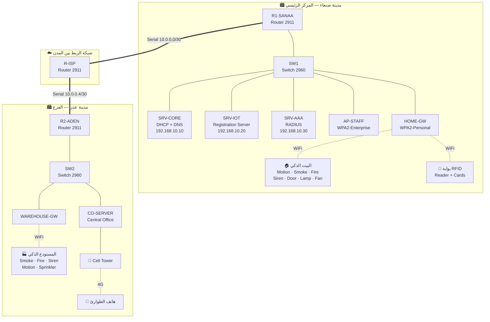

# مشروع «المدينة الذكية» — Cisco Packet Tracer + IoT

مشروع تخرّج / مشروع مادة إنترنت الأشياء، مبني بالكامل على **Cisco Packet Tracer 8.x**،
يربط **مدينتين** عبر شبكة WAN، ويجمع الشبكات السلكية واللاسلكية مع أجهزة إنترنت الأشياء
وأنظمة الحماية والمصادقة.

---

## المواضيع المُطبَّقة في المشروع

| # | الموضوع المطلوب | أين تم تطبيقه | الملف |
|---|---|---|---|
| 1 | الربط السلكي واللاسلكي | Switch + AP + Home Gateway | [02](02-switching-vlans.md) · [05](05-wireless-wpa2-aaa.md) |
| 2 | DHCP | سيرفر DHCP في صنعاء + راوتر DHCP في عدن | [04](04-dhcp-dns.md) |
| 3 | DNS | سيرفر DNS يخدم المدينتين | [04](04-dhcp-dns.md) |
| 4 | مستشعر الحركة Motion Detector | البيت الذكي + بوابة المستودع | [06](06-iot-sensors-actuators.md) |
| 5 | RFID | بوابة دخول الموظفين | [07](07-rfid-access-control.md) |
| 6 | WPA2 & AAA | SSID شخصي + SSID مؤسسي مع RADIUS | [05](05-wireless-wpa2-aaa.md) |
| 7 | مستشعرات الدخان والحرائق | Smoke Detector + Fire Monitor | [06](06-iot-sensors-actuators.md) |
| 8 | Siren صفارة الإنذار | تُشغَّل تلقائيًا عند الدخان/الحريق | [06](06-iot-sensors-actuators.md) |
| 9 | Cell Tower | تغطية خلوية لهواتف الطوارئ في عدن | [08](08-cell-tower.md) |
| 10 | التوزيع والربط في Physical Mode | مدينتان + مبانٍ + غرف اتصالات + Racks | [09](09-physical-mode.md) |
| 11 | تغيير الخلفيات وترتيب الأسلاك | خلفيات مخصّصة + تنظيم الكابلات | [09](09-physical-mode.md) |
| 12 | الربط بين المدن | Serial WAN + OSPF عبر راوتر ISP | [03](03-routing-wan.md) |

---

## فهرس المستندات

| الملف | المحتوى |
|---|---|
| [01-ip-plan.md](01-ip-plan.md) | خطة العنونة الكاملة وجدول كل جهاز |
| [02-switching-vlans.md](02-switching-vlans.md) | السويتشات، الـ VLANs، الـ Trunk، Port-Security |
| [03-routing-wan.md](03-routing-wan.md) | الراوترات، الربط بين المدن، OSPF، SSH |
| [04-dhcp-dns.md](04-dhcp-dns.md) | إعداد DHCP (سيرفر + راوتر) وإعداد DNS |
| [05-wireless-wpa2-aaa.md](05-wireless-wpa2-aaa.md) | WPA2-Personal، WPA2-Enterprise، RADIUS/AAA |
| [06-iot-sensors-actuators.md](06-iot-sensors-actuators.md) | الحركة، الدخان، الحريق، السايرن، شروط IoT |
| [07-rfid-access-control.md](07-rfid-access-control.md) | RFID Reader + Cards + التحكم بالباب |
| [08-cell-tower.md](08-cell-tower.md) | برج الاتصالات والـ Central Office Server |
| [09-physical-mode.md](09-physical-mode.md) | الوضع الفيزيائي، الخلفيات، ترتيب الأسلاك |
| [10-testing-checklist.md](10-testing-checklist.md) | خطة الاختبار وقائمة التسليم |
| [code/](code/) | أكواد Python للـ MCU داخل Packet Tracer |

---

## نظرة عامة على الطوبولوجيا



---

## قائمة الأجهزة المطلوبة (Bill of Materials)

### أجهزة الشبكة
| الجهاز | الموديل في Packet Tracer | العدد | ملاحظة |
|---|---|---|---|
| راوتر | ISR 2911 | 3 | يحتاج كل واحد وحدة **HWIC-2T** للمنافذ Serial |
| سويتش | Catalyst 2960-24TT | 2 | |
| Access Point | AP-PT | 1 | لشبكة الموظفين المؤسسية |
| Home Gateway | Home Gateway (HGW) | 2 | واحد لكل مدينة، لأجهزة IoT |
| Cell Tower | Cell Tower | 1 | في عدن |
| Central Office Server | Central Office Server | 1 | يربط البرج بالشبكة |

### السيرفرات (Server-PT)
| السيرفر | الخدمات المفعّلة |
|---|---|
| `SRV-CORE` | DHCP + DNS |
| `SRV-IOT` | IoT Registration Server |
| `SRV-AAA` | AAA (RADIUS) |
| `SRV-WEB` | HTTP (لوحة معلومات المشروع) — اختياري |

### أجهزة إنترنت الأشياء (Smart Things)
| الجهاز | النوع | المدينة |
|---|---|---|
| Motion Detector | Sensor | صنعاء + عدن |
| Smoke Detector | Sensor | صنعاء + عدن |
| Fire Monitor | Sensor | صنعاء + عدن |
| RFID Reader + RFID Cards ×3 | Security | صنعاء |
| Siren | Actuator | صنعاء + عدن |
| Fire Sprinkler | Actuator | صنعاء + عدن |
| Smart Door | Actuator | صنعاء |
| Lamp / Ceiling Fan / Webcam / Alarm | Actuator | صنعاء |
| MCU-PT | Microcontroller | لتشغيل أكواد Python |

### أجهزة المستخدمين
PC ×4 · Laptop ×2 · Smartphone ×2 · Tablet ×1

### الكابلات
- **Copper Straight-Through** — PC/Server ↔ Switch، Switch ↔ Router
- **Copper Cross-Over** — Switch ↔ Switch (اختياري)
- **Serial DCE** — بين الراوترات (ضع الـ DCE على الطرف الذي ستكتب فيه `clock rate`)
- **Coaxial** — Cell Tower ↔ Central Office Server
- **Fiber** — إذا زادت المسافة عن 100 متر في الوضع الفيزيائي

---

## ترتيب العمل الموصى به

اتبع الملفات بالترتيب — كل ملف يبني على الذي قبله:

```
01 خطة العنونة  →  02 السويتشات و VLANs  →  03 الراوترات و WAN
   →  04 DHCP و DNS  →  05 اللاسلكي و WPA2/AAA
   →  06 حساسات IoT  →  07 RFID  →  08 Cell Tower
   →  09 الوضع الفيزيائي  →  10 الاختبار النهائي
```

> **نصيحة مهمة:** احفظ الملف باسم مرقّم بعد كل مرحلة
> (`SmartCity_01_VLANs.pkt` ، `SmartCity_02_Routing.pkt` ...)
> حتى ترجع لأي مرحلة إذا حصل خطأ.

---

## كلمات المرور المستخدمة في المشروع

| الغرض | القيمة |
|---|---|
| Enable secret على كل الراوترات والسويتشات | `Cisco@123` |
| مستخدم محلي | `admin` / `Admin@123` |
| مفتاح RADIUS المشترك (Shared Secret) | `Radius@123` |
| كلمة شبكة الـ IoT اللاسلكية (WPA2-PSK) | `IoT@Home2024` |
| حساب سيرفر الـ IoT | `admin` / `admin123` |

> غيّرها إن أردت، لكن غيّرها **في كل المواضع** حتى لا تفشل المصادقة.
